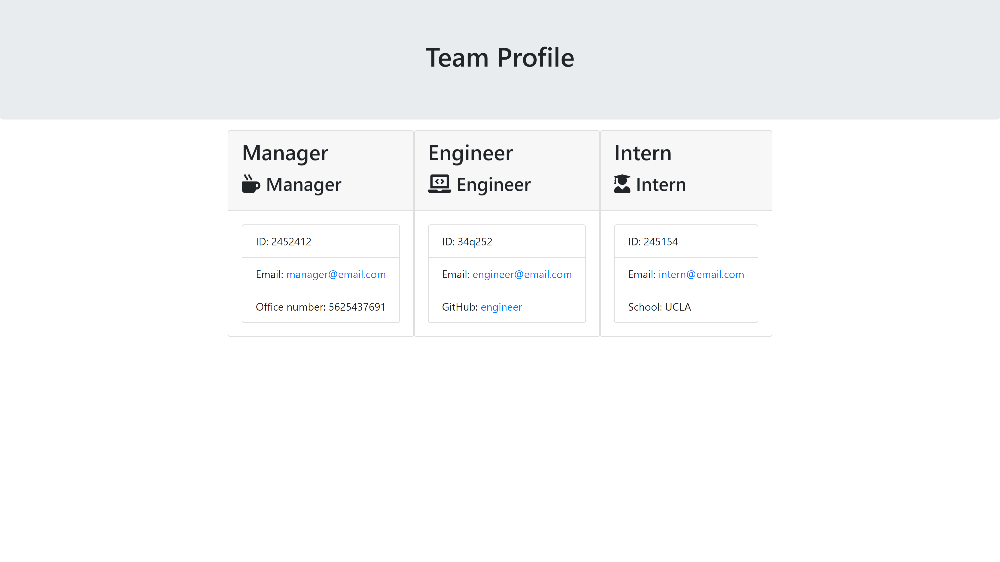

## GitHub Username
mchisem

# TeamProfileGenerator

## Description

Answer some easy questions in node app.js and have your team's user profiles generated!

## Table of Contents

* [Installation](#installation)
* [Usage](#usage)
* [License](#license)
* [Contributing](#contributing)
* [Tests](#tests)
* [Questions](#questions)

## Installation

To install necessary dependencies, input the following in your terminal:

...
npm install
...

## Usage

...
Enables your team's profile to be generated properly
...

## License

...
MIT
...

## Contributing

...
N/A
...

## Tests

In order to run tests, input the following in your terminal:

...
npm run test
...

## Questions

Questions? Contact me at [mchisem](http://github.com/mchisem) or [chisem.maya@gmail.com](http://chisem.maya@gmail.com)
